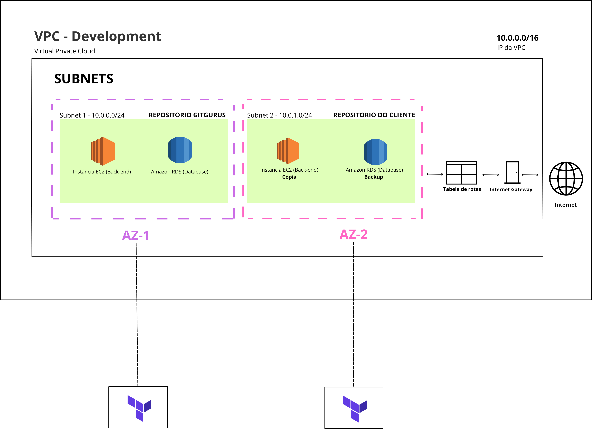

# Diagrama da arquitetura 

A arquitetura do projeto utiliza o serviço de cloud da Amazon Web Services (AWS). Ela está organizada dentro de uma Virtual Private Cloud (VPC) com o bloco de IPs 10.0.0.0/16, o que permite isolar os recursos da aplicação e controlar o tráfego de rede.

## Subnets:
A VPC está dividida em duas sub-redes (subnets) em zonas de disponibilidade (AZs) distintas para garantir alta disponibilidade e tolerância a falhas:

- Subnet 1 (10.0.0.0/24): localizada na AZ-1, hospeda os recursos principais do repositório GITGURUS, incluindo uma instância EC2 para o backend da aplicação e um banco de dados Amazon RDS.
- Subnet 2 (10.0.1.0/24): localizada na AZ-2, hospeda os recursos do repositório do cliente, com uma instância EC2 para o backend e um banco de dados Amazon RDS, ambos configurados como cópias de backup dos recursos na Subnet 1.

## Conectividade:
- Internet Gateway: permite que os recursos da VPC se comuniquem com a internet e permite o acesso externo à aplicação.
- Route Tables: controla o roteamento do tráfego de rede dentro da VPC, direcionando as requisições para os destinos corretos.

## Recursos utilizados:
- Instâncias EC2: servidores virtuais que executam o backend da aplicação.
- Amazon RDS: fornece um serviço de banco de dados gerenciado para armazenar os dados da aplicação.