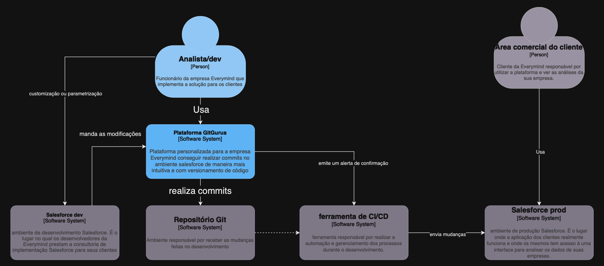

# Diagrama C4 (nível 1 - contexto)

O Diagrama C4 é uma maneira de representar a visão arquitetural de um projeto de maneira simples, intutiva e adaptativa, ou seja, foi criada para que os integrantes do projeto conseguissem entender de mandeira mais simples certa arquitetura, e pudessem realizar mudanças com mais facilidade nela caso fosse necessário. 

O diagrama C4 é dividido em 4 níveis: contexto, container, componentes e código. Para este projeto, foi desenvolvido apenas o nível de contexto, que pode ser visto abaixo.

    
     

O diagrama pode ser visto com mais qualidade no link a seguir: https://app.diagrams.net/#G1NY5GW0nzyNyR92uzc9JW-LZKWoNsScac#%7B%22pageId%22%3A%22uY-CG1yEjEPSqS4Edp_-%22%7D

### 1.1 Atores que interagem com o sistema

Os atores que interagem com este sistema são as entidades que executam e influenciam os processos dentro do ecossistema de desenvolvimento de software:

- **Analista/dev [Pessoa]:** Funcionário da empresa Everymind que implementa soluções para os clientes.
- **Área comercial do cliente [Pessoa]:** Cliente da Everymind responsável por utilizar a plataforma Salesforce e ver as análises dos dados da sua empresa.
- **Salesforce dev [Software System]:** Ambiente de desenvolvimento Salesforce onde os desenvolvedores da Everymind prestam consultoria e implementação do Salesforce para seus clientes.
- **Plataforma GitGurus [Software System]:** Plataforma personalizada para a empresa para realizar commits no ambiente de maneira mais intuitiva e com versionamento de código.
- **Repositório Git [Software System]:** Ambiente responsável por receber as mudanças feitas pelos desenvolvedores.
- **Ferramenta de CI/CD [Software System]:** Ferramenta responsável por realizar a automação e gerenciamento dos processos durante o desenvolvimento.
- **Salesforce prod [Software System]:** Ambiente de produção Salesforce onde a aplicação dos clientes realmente funciona e onde os mesmos têm acesso a uma interface para analisar os dados das suas empresas.

Esses são os atores que interagem diretamente e indiretamente com o sistema da Everymind, onde cada um deles tem um papel crucial para estarem no diagrama, desde o desenvolvimento de soluções personalizadas até a análise final dos dados pelo cliente.

### 1.2 Principais componentes do sistema (alto nível)

**Salesforce dev e Salesforce prod [Software Systems]**

Estes são os ambientes onde ocorrem o desenvolvimento e a operação das soluções Salesforce, respectivamente. O ambiente dev é onde a consultoria e personalização ocorrem, e o prod (produção) é onde a aplicação é executada de fato para análise de dados.

**Plataforma GitGurus e Repositório Git [Software Systems]**

Estas plataformas são cruciais para o gerenciamento e versionamento do código fonte. O GitGurus proporciona uma interface personalizada para a empresa realizar commits, enquanto o Repositório Git mantém as versões do código fonte.

**Ferramenta de CI/CD [Software System]**

Responsável pelo processo de integração contínua e entrega contínua/deploy, garantindo que o código desenvolvido seja testado e entregue de forma eficiente e confiável ao ambiente de produção.

### 1.3 Relacionamento entre os atores e componentes

O relacionamento entre os componentes e atores explicados abaixo demonstra um fluxo contínuo de desenvolvimento, teste, entrega e análise, que são fatores fundamentais para o funcionamento do sistema com qualidade.

- **Analista/dev → Salesforce dev**

O analista/dev utiliza diretamente o sistema de desenvolvimento da Salesforce para realizar as implementações para o cliente.

- **Analista/dev → Plataforma GitGurus → Repositório Git**

O Analista/dev utiliza a Plataforma GitGurus para realizar modificações no código. As mudanças são então enviadas ao Repositório Git, que mantém o versionamento e o histórico de alterações.

- **Repositório Git → Ferramenta de CI/CD → Plataforma GitGurus**

Após as mudanças serem feitas e armazenadas no Repositório Git, a Ferramenta de CI/CD é notificada por meio de um alerta emitido da plataforma GitGurus de que o processo de teste e entrega das modificações para o ambiente de produção pode ser iniciado.

- **Ferramenta de CI/CD → Salesforce prod**

Uma vez que o código passou pelo processo de CI/CD, ele é entregue e implementado no Salesforce prod, onde o cliente pode interagir com a aplicação final.

- **Área comercial do cliente → Salesforce prod**

A área comercial do cliente utiliza diretamente o ambiente de produção do Salesforce para analisar dados e métricas importantes para a tomada de decisões estratégicas.
