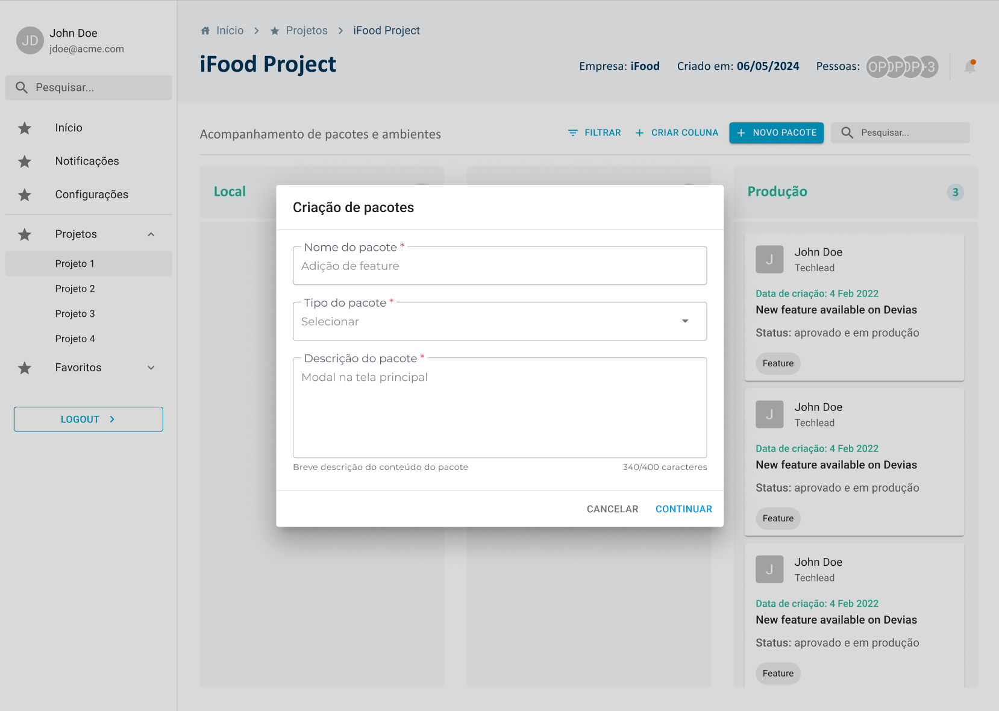
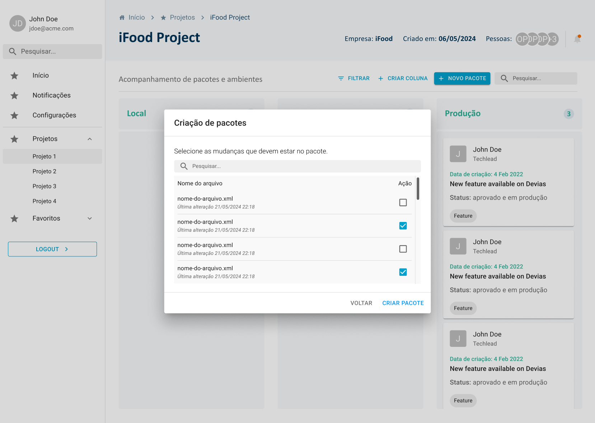
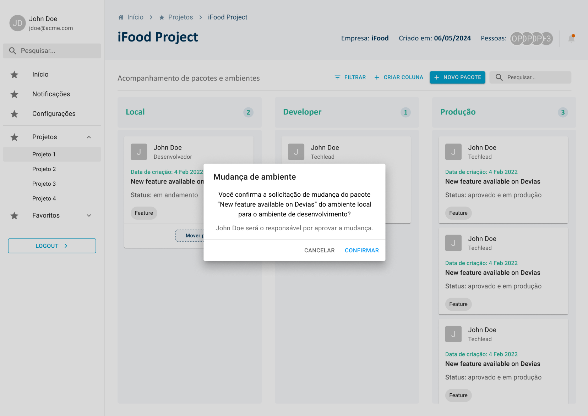
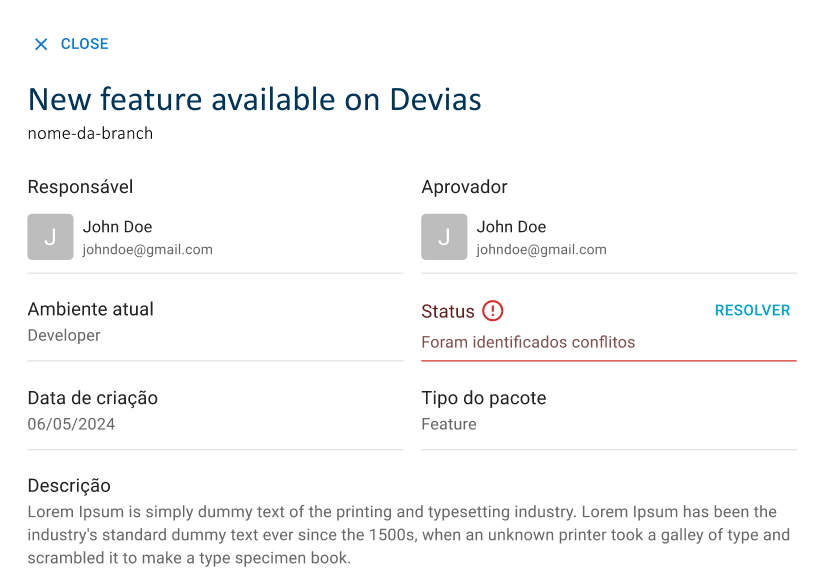

# Implementação de funcionalidades

Este documento tem o objetivo de relatar as principais funcionalidades feitas no projeto até o momento, ou seja, as que mais agregam valor para o parceiro em termos de interface, além de explicar outros pontos do desenvolvimento, como o backend e banco de dados.

## Funcionalidades do frontend

A seguir serão citadas as principais funcionalidade presentes no frontend atual, sem considerar a integração com o backend.

### Criação de pacotes e seleção de modificaçãoes

Na sprint 3, foi adicionado à interface os dois modais que compõe o processo de criação de um pacote. Ao clicar no botão `+ NOVO PACOTE` na tela principal, o usuário irá abrir o primeiro modal, o qual precisa ser preenchido com informações gerais do pacote, como nome, tipo e descrição. Ao continuar o fluxo, o usuário é direcionado para um segundo modal, na qual pode selecionar quais arquivos XML realizou as mudanças para poder então criar um pacote.

Abaixo é possível visualizar a imagem de ambos modais:

    
     

    
     

### Mover cards entre colunas com confirmação

Na sprint 2, foi adicionada a funcionalidade de mover cards (pacotes) entre colunas do kanban, porém, apenas na sprint 3 que ao realizar essa ação a interface informa ao usuário por meio de um modal que uma mudança de ambiente foi solicitada e que a mesma precisa ser confirmada.

Abaixo, é possível visualizar o modal referente à confirmação da mudança: 

    
     

### Visualizar informações mais específicas de um pacote

Na sprint 3, foi implementada uma funcionalidade na qual permite que o usuário veja as informações completas de um pacote criado, sendo elas: responsável, aprovador, ambiente atual, status, data de criação, tipo do pacote e descrição. Essa funcionalidade aparece quando o usuário clica em cima do card de um pacote e é extremamente importante para manter todos do projeto atualizados sobre o seu andamento.

Abaixo, é possível visualizar a tela que contém essas informações:

    
     

## Banco de dados

Até o momento, foi criado um banco de dados local utilizando docker e o seu respectivo schema com o Prisma. A modelagem foi feita baseando-se no que foi discutido no arquivo [modelos banco de dados](./modelos-banco-de-dados.md).