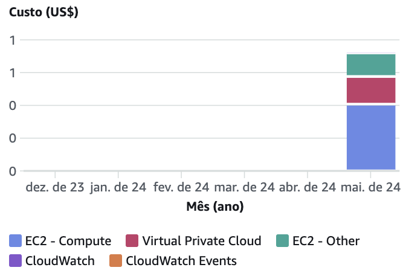
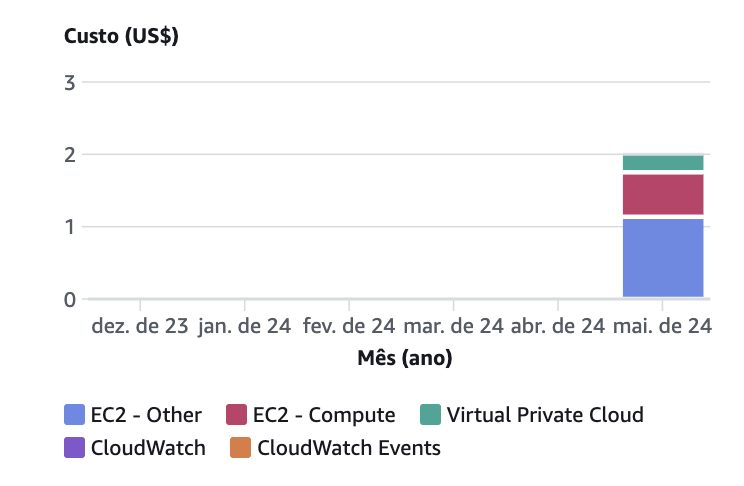

# Definição de métricas

Por meio da definição e coleta de métricas focadas no monitoramento de desempenho, o grupo visa gerar métricas que ajudam a entender o progresso e a qualidade do trabalho do grupo pela equipe durante o desenvolvimento do projeto para que seja possível encontrar pontos de melhoria no decorrer das sprints. Desse modo, é possível obter dados mais precisos para avaliar a qualidade e o progresso do projeto, além analizar a eficiência do grupo em seu de desenvolvimento.

_As seguintes métricas foram criadas neste [documento](https://docs.google.com/spreadsheets/d/1YJJOIsq76pzpn1VMyrNCQrw8P77hp8v3GF9sz7GGMAs/edit?usp=sharing)_

## Service Support

Tais métricas tem foco em analisar a qualidade e eficiência do desenvolvimento do projeto e são importantes principalmente para garantir a rastreabilidade de impedimentos e incidentes durante o processo de desenvolvimento do grupo com o intuito de encontrar soluções e melhorias em resposta à possíveis empecilhos no projeto.

### Métrica 1 - Taxa de incidentes por determinada causa em uma sprint
O objetivo dessa métrica é manter número de incidentes menor ou igual a 5 por sprint de desenvolvimento, analisando onde tais incidentes ocorrem e os seus principais causadores. Dessa forma o grupo pode otimizar sua alocação de esforços para resolver determinadas questões ao invés de outras.

Para tal, será feito o registro diário de todos os incidentes ocorridos, contendo data, hora, causa e impactos, e à partir disso é feito o cálculo percentual de número de incidentes por determinada causa dividido pela quantidade total de incidentes.

### Métrica 2 - Taxa de bugs por implementação em uma sprint 
Com essa métrica, o grupo visa manter a taxa de bugs por implementação durante uma sprint abaixo de 60%. Será analisada a quantidade de problemas que ocorrem durante a implementação de uma funcionalidade, os principais bugs que aparecem durante o desenvolvimento e onde eles ocorrem.

Para o cálculo dessa métrica, com a coleta e registro diário de todos os bugs que aparecerem ao longo do desenvolvimento contendo data, hora, causa e impactos, é feita a soma dos problemas durante a sprint e isso é dividido pela soma de funcionalidades implementadas naquela mesma sptint.

## Service Delivery

Essa categoria se refere a qualidade das entregas do projeto, com foco principal na análise de conformidade do produco com os requisitos e as expectativas do cliente. Essas métricas ajudam a garantir que as entregas atendam os padrões de qualidade estabelecidos pelo cliente e pelo próprio grupo.

### Métrica 1 - Média de notas recebidas por cada sprint por meio de um NPS
A métrica em questão busca garantir que as expectativas de entrega do projeto estejam alinhadas e que o desenvolvimento esteja ocorrendo conforme o esperado, verificando se ideia do produto final está sendo bem comunicada, se as expectativas estão alinhadas com o cliente e se o grupo evoluiu o desenvolvimento do projeto dentro do esperado durante as sprints. Para que essa análise seja possível, será enviado um formulário para o parceiro com perguntas sobre o desenvolvimento do projeto, e a resposta de cada uma é em formato de NPS de 0 a 10. Para essa métrica foi estabelecido que a média geral do resultado dos NPSs pra cada pergunta precisa ser de no mínimo 8/10.

Sendo assim, será feita apenas uma conta, sendo ela a soma das notas por pergunta dividido pelo número de respostas da mesma. Esse resultado possibilita avaliar se o grupo está desenvolvendo o projeto dentro das expectativas.

### Métrica 2 - Porcentagem do NPS relacionado ao desenvolvimento no grupo por sprint

Essa em questão pode ser considerada um extenção da métrica anterior, também se utilizando do formulário sobre o desenvolvimento do projeto, porém com o foco em análise da tendência de respostas, tendando descobrir elas foram em sua maioria positivas ou negativas. O objetivo é garantir que o cliente esteja satisfeito com as entregas, e para isso o resultado do cálculo do NPS precisa ser igual ou maior que 50%.

O cálculo estabelecido se dá pelo próprio NPS, ou seja, % de clientes promotores - % de clientes defratores.

## Analítico

As métricas analíticas servem principalmente para mensurar o desempenho do grupo com os processos de desenvolvimento. Com tais análises, é possivel avaliar a produtividade dos membros de maneira conjunta e identificar oportunidades de melhoria na eficiência do desenvolvimento.

### Métrica 1 - Taxa de histórias que não foram implementadas no tempo de uma sprint
Essa métrica tem como objetivo garantir que a taxa de histórias que excedem o lead time de uma sprint seja menor que 5%. A partir deste objetivo, será trabalhado o entendimento de quais áreas são as funcionalidades que não foram implementadas e qual o tempo médio para implementar uma funcionalidade. Dessa forma, para solucionar tais questões, foi estabelecido o seguinte cálculo:```histórias criadas que foram implementadas / histórias criadas no total criadas para a sprint no total```

O cálculo do lead time evidencia o tempo total que uma funcionalidade demorou para ser concluída a partir do momento da sua criação até o momento que é finalizada. O seu resultado fornece insights sobre o ritmo de desenvolvimento do grupo.

### Métrica 2 - Taxa de tarefas que excederam o tempo definido de um cycle time aceitável por sprint
Essa métrica tem como objetivo garantir que o número de tarefas que excedem o cycle time de 2 dias deve ser menor que 5 por sprint. A partir deste objetivo, será buscado uma melhor compreensão de quanto tempo uma tarefa demora para ser terminada a partir de seu início e quantas tarefas passam do prazo de entrega? Dessa forma, para solucionar tais questões, foram estabelecidos os seguintes cálculos:

**Primeiro cálculo:** lead time individual
```Cycle Time = Data de Conclusão da Tarefa - Data de Criação da Tarefa```

**Segundo cálculo:** somar as tarefas que excederam o leadtime

Nesse sentido, o cálculo de cycle time evidencia o tempo total de realização da tarefa do momento da sua criação até o momento que é finalizada. O seu resultado fornece insights sobre o ritmo de desenvolvimento do grupo.

### Métrica 3 - Taxa de vazão de tasks no kanban
Essa métrica tem como objetivo garantir que pelo menos 8 tasks (representadas pelos cards no kanban) sejam concluídas por dia. A partir deste objetivo, será desenvolvido um melhor entendimento de qual a quantidade média de tasks por sprint, qual área mais gera tasks e de qual o tempo médio para a resolução de uma task.Dessa forma, para solucionar tais questões, foram estabelecidos os seguintes cálculos:

**Primeiro cálculo** = Número total de tarefas em uma sprint dividido pelo número total de dias úteis em uma sprint

**Segundo cálculo** = Horas dedicadas às tarefas divididas pela quantidade de tarefas”

Nesse sentido, O primeiro cálculo é necessário para verificar qual a quantidade mínima de tarefas que devem ser realizadas pela equipe diariamente ao longo da sprint. Já o segundo cálculo indica qual a quantidade média de tempo gasto por tarefa, o que vai ajudar na organização do tempo necessário de dedicação ao desenvolvimento do projeto, e para coletar os dados usados para construir tais métricas, será realizado o primeiro cálculo descrito na planilha no início de cada sprint para definir a quantidade de tarefas que cada integrante do grupo irá realizar por dia. Além disso, cada um dos indivíuos será responsável por medir quanto tempo gasta em cada atividade, possibilitando assim, o cálculo da média de tempo gasto por atividade.

## Produtividade FinOps

No caso das métricas de FinOps, é analisada a otimização dos gastos principalmente em infraestrutura e no uso de cloud, ajudando na estipulação de valores de custo de produção para o cliente.

### Métrica 1 - Analise dos custos durante o desenvolvimento do software

Essa métrica tem como objetivo manter o custo do uso de cloud dentro de uma media esperada. Tendo como visão determinar o custo os serviços em cloud utilizados geram por mês, e quais serviços são utilizados e quais deles geram mais custos. Sendo assim, o cálculo dele é dado por:

**custoMensal** = (somatório de (preçoPorHora do serviço * unidades do serviço * horasPorDia * diasPorMês) para cada tipo de serviço computacional) + (somatório de (custoPorGBPorMês * gigabytes usados) para cada tipo de serviço de armazenamento) + (somatório de (custoPorGB * gigabytes transferidos) para cada tipo de serviço de transferência de dados)

Este cálculo tem como objetivo garantir que o uso de recursos em cloud não exeda o valor medio de uso padrão.

A coleta desta métrica é feita atraves do acompanhamento mensal dos gastos em serviço de nuvem, utilizando os relatorios dos provedores da cloud, como a AWS.

# Coleta de métricas

## Service Support

### Sprint 2

#### Métrica 1 - Taxa de incidentes por determinada causa em uma sprint

Nesta sprint não tivemos incidentes em produção. A partir da próxima sprint faremos subidas para a branch main com mais frequência para acompanhar a performance da aplicação em produção ao longo da sprint, registrando os incidentes ocorridos, se acontecerem. 

#### Métrica 2 - Taxa de bugs por implementação em uma sprint

Nesta sprint, os bugs foram resolvidos antes de passarem para o repositório no Github. Isso pode ser visto após a utilização do sonarqube e do sonarscanner que não identificaram nenhum bug antes dos commits para o repositório. Nesse sentido, o cálculo seria realizado assim:
```Taxa de bugs por implementação em uma sprint = Quantidade total de bugs / Quantidade de implementações```.
Como a quantidade total de bugs foi de 0, então a taxa final foi de 0 bugs por implementação

### Sprint 3

#### Métrica 1 - Taxa de incidentes por determinada causa em uma sprint

Tivemos duas subidas ao longo desta Sprint, e não tivemos incidentes em produção.


#### Métrica 2 - Taxa de bugs por implementação em uma sprint

Na sprint 3, houveram 2 bugs após a implementação do frontend do projeto. O primeiro bug foi o de não ser possível executar o projeto devido à remoção de um export do Router e de uma linha de importação do UseNavigation. Após o conserto deste bug, outro apareceu, em que as páginas do frontend não estavam sendo renderizadas devido a conflitos no merge das branchs trabalhadas. Dessa forma, a partir do cálculo da Taxa de bugs por implementação em uma sprint e sabendo que nós tivemos problema só na implementação do frontend, o cálculo desta taxa ficaria:
</br>
```Taxa de bugs por implementação em uma sprint = 2 / 1```
</br>
Desta forma, é importante que fiquemos alerta à resolução de conflitos ao mergear branches, uma vez que esta foi a causa dos bugs captados nesta sprint.

### Sprint 4

#### Métrica 1 - Taxa de incidentes por determinada causa em uma sprint

Tivemos duas subidas ao longo desta Sprint, e não tivemos incidentes em produção.


#### Métrica 2 - Taxa de bugs por implementação em uma sprint

## Service Delivery 

### Sprint 1

Nessa sprint, foram obtidas apenas 2 respostas do formulário enviado, sendo ambas dos parceiros. Este, apresentava as seguintes perguntas:
- O grupo evoluiu o desenvolvimento do projeto dentro do esperado para a sprint?
- O parceiro ficou satisfeito com a apresentação?

Com base nas respostas dessas perguntas, foi possível fazer duas análises, que estão descritas a seguir.

#### Métrica 1 - Média de notas recebidas por cada sprint por meio de um NPS

A média das notas é dada pelo seguinte cálculo: 

**Pergunta 1:** "O grupo evoluiu o desenvolvimento do projeto dentro do esperado para a sprint?"
- Número de respostas: 2
- Soma das notas: 15 (8 + 7)
- Média notas: 7,5 (15 / 2)

**Pergunta 2:** "O parceiro ficou satisfeito com a apresentação?"
- Número de respostas: 2
- Soma das notas: 15 (8 + 7)
- Média notas: 7,5 (15 / 2)

**Conclusão:** a equipe não atingiu o objetivo da métrica nesta sprint, pois a média das notas de ambas perguntas ficou abaixo de 8, indicando que há pontos de melhoria a serem considerados nas próximas entregas.

#### Métrica 2 - Porcentagem do NPS relacionado ao desenvolvimento no grupo por sprint

Ambas respostas dos clientes para as perguntas foram em uma nota neutra, e por isso, infelizmente o cálculo do NPS se torna inviável.

### Sprint 2

Na sprint 2, foram obtidas apenas 3 respostas, sendo duas do time acadêmico do Inteli e uma do parceiro. Infelizmente, a quantidade de respostas ainda é baixa, e isso pode causar viéses no resultado.

O formulário seguiu com o mesmo pensamento das perguntas da sprint anterior:
- O que tem achado do projeto até então?
- Como você qualifica a qualidade da nossa apresentação?

Com base nas respostas dessas perguntas, foi possível fazer duas análises, que estão descritas a seguir.

#### Métrica 1 - Média de notas recebidas por cada sprint por meio de um NPS

A média das notas é dada pelo seguinte cálculo: 

**Pergunta 1:** "O que tem achado do projeto até então?"
- Número de respostas: 3
- Soma das notas: 26 (10 + 9 + 7)
- Média notas: 8,6 (26 / 3)

**Pergunta 2:** "Como você qualifica a qualidade da nossa apresentação?"
- Número de respostas: 3
- Soma das notas: 27 (10 + 9 + 8)
- Média notas: 9 (27 / 3)

**Conclusão:** a equipe atingiu o objetivo da métrica, pois a média das notas de ambas perguntas ficou entre 8 e 10.

#### Métrica 2 - Porcentagem do NPS relacionado ao desenvolvimento no grupo por sprint

Foi feito o cálculo do NPS ([planilha com cálculo](https://docs.google.com/spreadsheets/d/1ekSxLDczF81UEcCqMxMexIxIVQ-pScmuLcjmB_Zxgf0/edit?usp=sharing)) para a primeira e segunda pergunta, e ambos resultados foram de 66.6%, uma vez que ambas perguntas tiveram duas respostas promotoras e uma neutra.

Mesmo com poucas respostas, pode-se perceber que ainda foi possível atingir o objetivo, que é ter um resultado igual ou maior que 50%.

### Sprint 3

Na sprint 3, foram obtidas mais resposas comparada com a passada, mas o número ainda é baixo, sendo 6 no total. Infelizmente, até o momento que está documentação está sendo feita, o parceiro ainda não resposdeu à pesquisa, apenas alunos e o orientador.

O formulário possui as perguntas da sprint anterior:
- O que tem achado do projeto até então?
- Como você qualifica a qualidade da nossa apresentação?

Com base nas respostas dessas perguntas, foi possível fazer duas análises, que estão descritas a seguir.

#### Métrica 1 - Média de notas recebidas por cada sprint por meio de um NPS
A média das notas é dada pelo seguinte cálculo: 

**Pergunta 1:** "O que tem achado do projeto até então?"
- Número de respostas: 9
- Soma das notas: 85 (6*10 + 2*9 + 7)
- Média notas: 9,4 (85 / 9)
  
**Pergunta 2:** "Como você classifica a qualidade da nossa apresentação?"
- Número de respostas: 9
- Soma das notas: 79 (2*10+ 4*9 + 2*8 + 7)
- Média notas: 8,7 (79 / 9)

**Conclusão:** A equipe atingiu o objetivo da métrica, pois a média das notas de ambas perguntas ficou entre 8 e 10 e superou as notas da ultima sprint.

#### Métrica 2 - Porcentagem do NPS relacionado ao desenvolvimento no grupo por sprint

Foi feito o cálculo do NPS ([planilha com cálculo](https://docs.google.com/spreadsheets/d/1ekSxLDczF81UEcCqMxMexIxIVQ-pScmuLcjmB_Zxgf0/edit#gid=2049579972)) para a primeira e segunda pergunta, e o resultado da primeira pergunta foi de 100%, ou seja, das 6 respostas, todas foram com notas promotoras, o que indica que o projeto está evoluindo bem. Já a segunda pergunta, teve um resultado de 66.6%, o que significa que ainda temos alguns pontos a melhorar na apresentação. Felizmente, as respostas apresentam feedback e por isso foi possível obter um direcionamento de como melhorar.

Com um número um pouco maior de respostas, é possível obter um resultado mais assertivo, e felizmente o objetivo foi atingido, já que a ambas perguntas tiveram o seu resultado acima de 50%.

### Sprint 4

Na sprint 4, foram obtidas mais resposas comparada com a passada, mas o número ainda é baixo, sendo 10 até o momento. Infelizmente, até o momento que está documentação está sendo feita, o parceiro ainda não resposdeu à pesquisa, apenas alunos, professores e o orientador.

O formulário possui as perguntas da sprint anterior:
- O que tem achado do projeto até então?
- Como você qualifica a qualidade da nossa apresentação?

Com base nas respostas dessas perguntas, foi possível fazer duas análises, que estão descritas a seguir.

#### Métrica 1 - Média de notas recebidas por cada sprint por meio de um NPS
A média das notas é dada pelo seguinte cálculo: 

**Pergunta 1:** "O que tem achado do projeto até então?"
- Número de respostas: 19
- Soma das notas: 175 ( 10*10 + 4*9 + 4*8 + 7)
- Média notas: 9.2  (85 / 19)
  
**Pergunta 2:** "Como você classifica a qualidade da nossa apresentação?"
- Número de respostas: 19
- Soma das notas: 171 (6*10+ 8*9 + 4*8 + 7)
- Média notas: 9 (9 / 19)

**Conclusão:** A equipe atingiu o objetivo da métrica, pois a média das notas de ambas perguntas ficou entre 8 e 10 e a nota da segunda pergunta superou as notas da ultima sprint.

#### Métrica 2 - Porcentagem do NPS relacionado ao desenvolvimento no grupo por sprint

Foi feito o cálculo do NPS ([planilha com cálculo](https://docs.google.com/spreadsheets/d/1ekSxLDczF81UEcCqMxMexIxIVQ-pScmuLcjmB_Zxgf0/edit#gid=847184850)) para a primeira e segunda pergunta, e o resultado da primeira pergunta foi de 60%, ou seja, das 10 respostas, 6 foram com notas promotoras, o que indica que não necessariamente significa que o projeto tenha decaído de qualidade, já que na sprint passada o NPS foi de 100%. A justificativa é que na sprint passada o grupo teve menos respostas, mas ainda assim, é um ponto a se atentar, já que alguns feedbacks relataram que o grupo poderia ter se aprofundado mais em algumas partes. Já a segunda pergunta, teve um resultado de 80%, o que mostra uma melhora significativa comparada a sprint passada, o que é muito benéfico para o grupo. 

Com um número um pouco maior de respostas, é possível obter um resultado mais assertivo, e felizmente o objetivo novamente foi atingido, já que a ambas perguntas tiveram o seu resultado acima de 50%.

## Analítico

### Sprint 2

#### Métrica 1 - Taxa de histórias que não foram implementadas no tempo de uma sprint

No decorrer da sprint atual, focamos em monitorar e melhorar a taxa de implementação das histórias de usuário, um indicador essencial para avaliar a eficácia do nosso processo de desenvolvimento e entrega. Neste período, estabelecemos o objetivo de completar um conjunto significativo de histórias para avançar no projeto.

Detalhes da Implementação:

Total de Histórias Planejadas: 56
Histórias Implementadas: 45

Análise de Desempenho:

A partir dos dados coletados, calculamos a taxa de implementação de histórias. Com 45 de 56 histórias concluídas, alcançamos uma taxa de implementação de 80,35% nesta sprint.

#### Métrica 2 - Taxa de tarefas que excederam o tempo definido de um cycle time aceitável por sprint

Total de Tarefas: 56</br>
Quantidade de tasks que ultrapassaram em 2 dias ou mais o cycle time: 17 tasks</br>
Conclusão: Excedemos em 12 tasks o limite de número de tasks que poderiam ultrapassar o cycle time de 2 dias, indicando que devemos melhorar nossa execução de tasks.

#### Métrica 3 - Taxa de vazão de tasks no kanban

Total de Tarefas: 56 </br>
Tarefas concluídas: 52 </br>
Dias úteis da sprint: 9 dias úteis </br>
Média de tasks diárias ≃ 6,22

Área com mais tasks: Configuração Esteira de CI (9 tasks)

Tempo gasto com tarefas: 52 horas e 21 minutos
Tempo médio por tarefa ≃ 1 hora

Conclusão: Em média, o grupo concluiu 8 tasks por dia, assim atingindo o objetivo da métrica.

### Sprint 3

#### Métrica 1 - Taxa de histórias que não foram implementadas no tempo de uma sprint

Detalhes da Implementação:

Total de Histórias Planejadas: 53
Histórias Implementadas: 45

Análise de Desempenho:

A partir dos dados coletados, calculamos a taxa de implementação de histórias. Com 45 de 53 histórias concluídas, alcançamos uma taxa de implementação de 84,90% nesta sprint.

#### Métrica 2 - Taxa de tarefas que excederam o tempo definido de um cycle time aceitável por sprint

Total de Tarefas: 53</br>
Quantidade de tasks que ultrapassaram em 2 dias ou mais o cycle time: 13 tasks</br>
Conclusão: Excedemos em 8 tasks o limite de número de tasks que poderiam ultrapassar o cycle time de 2 dias, indicando que por mais que tenha tido uma melhora na execução de tasks, ainda não está em nível aceitável.

#### Métrica 3 - Taxa de vazão de tasks no kanban

Total de Tarefas: 53 </br>
Tarefas concluídas: 45 </br>
Dias úteis da sprint: 10 dias úteis </br>
Média de tasks diárias = 5,3

Área com mais tasks: Design System (9 tasks)

Tempo gasto com tarefas: 62 horas e 12 minutos
Tempo médio por tarefa ≃ 1 hora e 22 minutos

Conclusão: Em média, o grupo concluiu 5 tasks por dia, não atingindo o objetivo da métrica. Além disso, a quantidade de tasks não concluídas foi maior que na Sprint anterior.

### Sprint 4

#### Métrica 1 - Taxa de histórias que não foram implementadas no tempo de uma sprint

Detalhes da Implementação:

Total de Histórias Planejadas: 45
Histórias Implementadas: 40

Análise de Desempenho:

A partir dos dados coletados, calculamos a taxa de implementação de histórias. Com 40 de 45 histórias concluídas, alcançamos uma taxa de implementação de 88,89% nesta sprint.

#### Métrica 2 - Taxa de tarefas que excederam o tempo definido de um cycle time aceitável por sprint

Total de Tarefas: 45</br>
Quantidade de tasks que ultrapassaram em 2 dias ou mais o cycle time: 11 tasks</br>
Conclusão: Excedemos em 6 tasks o limite de número de tasks que poderiam ultrapassar o cycle time de 2 dias, indicando que por mais que tenha tido uma melhora na execução de tasks, ainda não está em nível aceitável.

#### Métrica 3 - Taxa de vazão de tasks no kanban

Total de Tarefas: 45 </br>
Tarefas concluídas: 35 </br>
Dias úteis da sprint: 8 dias úteis </br>
Média de tasks diárias ≃ 5,6

Área com mais tasks: Design Ops (9 tasks)

Tempo gasto com tarefas: 56 horas e 48 minutos
Tempo médio por tarefa ≃ 1 hora e 37 minutos

Conclusão: Em média, o grupo concluiu aproximadamente 5 tasks e meia por dia, não atingindo o objetivo da métrica. Além disso, a quantidade de tasks não concluídas foi maior que na Sprint anterior. Um ponto para se levar em consideração foi a quantidade menor de dias úteis da sprint levando em conta o feriado de dois dias.

## Produtividade FinOps

### Sprint 2

#### Métrica 1 - Analise dos custos durante o desenvolvimento do software
Nesta sprint nossos custos no mês atual foram de US$ 0,72, providos da criação de maquinas virtuais ec2 da instancia t1 e t2 micro e da utilização de uma vpc.



### Sprint 3

#### Métrica 1 - Analise dos custos durante o desenvolvimento do software
Nesta sprint nossos custos no mês atual foram de US$ 2,02, providos da criação de maquinas virtuais ec2 da instancia t1 e t2 micro e da utilização de uma vpc.



