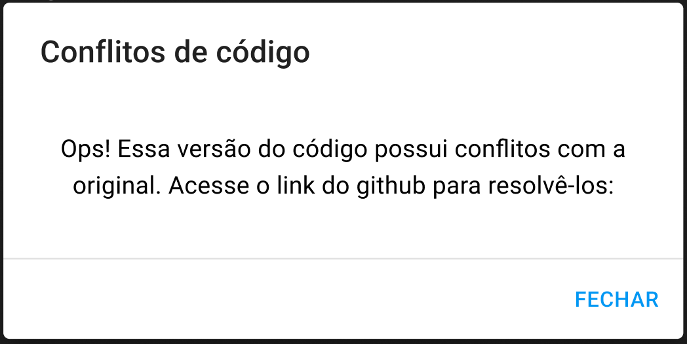

# Mockup da plataforma GitGurus

O Mockup é uma representação visual de um projeto ou produto que ajuda os desenvolvedores a realmente botarem em prática o que foi combinado. No caso deste projeto, foi desenvolvido o mockup de uma interface, sendo sua página principal um kanban. Por enquanto, apenas 3 páginas e 4 modais foram feitos, mas todos contemplando as funcionalidades principais.

O mockup pode ser visto em sua versão online no link a seguir: https://www.figma.com/file/Zub9UU4IKSfzwXDm6lm0jq/Interface?type=design&node-id=0%3A1&mode=design&t=IiHXC2PGaBIW43xd-1 

## Página inicial

A página inicial da nossa plataforma terá uma side bar, a qual irá permitir que o usuário navegue de forma rápida por toda a aplicação. Além disso, sua principal função é mostrar ao usuário quais projetos ele está participando.

    
     

## Página kanban

Essa página é a principal da interface, pois será a que o usuário mais terá contato. Cada coluna do kanban representa um ambiente do projeto, sendo os 3 principais o `Local`, no qual o usuário terá sua própria branch para realizar o desenvolvimento. Quando ele finalizar, o card é movido para o ambiente seguinte: `Develop`. A partir deste, apenas o TechLead poderá aprovar os Pull Requests e a mudança das funcionalidades para a `Produção`.

    
     

## Pacote

Essa tela é composta por todas as informações que um pacote possui, como Nome, Tipo e Descrição. Ele foi criado com a intenção de fornecer mais detalhes sobre o pacote, já que a descrição por exemplo, é um tópico que não aparece no card.

    
     

## Modais

### Modais relacionados à mudança de ambiente

Estes são modais que relatam ao usuário algum evento relacionado a mudar os pacotes para outros ambientes.

**Mudança de ambiente**: esse modal pede a confirmação do usuário quando ele aperta o botão de mudar um pacote de um ambiente para o outro.

    
     

**Erro ao realizar a mudança de ambiente**: esse modal aparece quando ocorre algum tipo de erro ao realizar a mudança de ambiente de um pacote.
- Observação: o modal referencia um link no github, mas este link ainda não está disponível e por isso não está no modal

    
     

**Conflitos de código**: esse modal aparece quando o erro ao realizar a mudança de ambiente de um pacote é referente à conflitos de código.
- Observação: o modal referencia um link no github, mas este link ainda não está disponível e por isso não está no modal

    
     

### Modal de criação de pacotes

Quando o usuário deseja criar um novo pacote para realizar algum desenvolvimento, ele clica no botão `+ NOVO PACOTE` na página principal (kanban) e um modal deve ser preenchido com as informações do mesmo.

    
     

