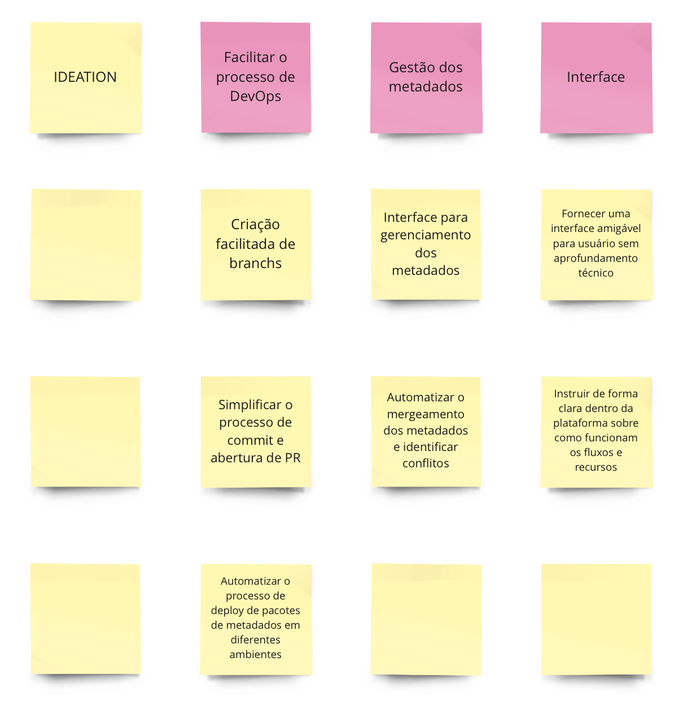

# Product discovery

O objetivo desse documento é ter uma visão completa do produto a ser enntregue ao cliente, além de alinhar as expectativas. Toda a análise foi feita no miro, e pode ser acessada [aqui](https://miro.com/app/board/uXjVKSeLkDQ=/)

# Índice
- [Visão do produto](#visão-do-produto)
- [É, não é, faz, não faz](#é-não-é-faz-não-faz)
- [Product goals](#product-goals)
- [Personas](#personas)
- [Brainstorm das features](#brainstorm-das-features)
- [Technical, Business and UX Review](#technical-business-and-ux-review)
- [Sequencer](#sequencer)
- [MVP canvas](#mvp-canvas)
- [Casos de uso](#casos-de-uso)

# Visão do produto

A visão do produto é o primeiro passo ao realizar o product discovery, já que fornece uma direção estratégica clara e inspiradora do produto, orientando todas as decisões de desenvolvimento. Ter uma visão bem definida mantém os objetivos alinhados entre a equipe, o que garante que o produto final atenda às expectativas dos stakeholders. A análise abaixo representa a primeira visão do produto deste projeto.

    
     

# É, não é, faz, não faz

O estudo de o que produto é, não é, faz e não faz é extremamente importante para um projeto, pois ajuda a alinhar as expectivas do produto final com os stakeholders, uma vez que estes podem esperar algo que no fim não é entregue pois não fazia parte do escopo. A análise abaixo representa esse estudo deste projeto.

    
     

# Product goals

Essa análise é importante pois se divide produto final em 3 principais objetivos, afim de destrinchar eles e descobrir as principais tarefas que o norteiam. Os notes abaixo representam os objetivos do produto deste projeto.

    
     

# Personas

Realizar personas em um projeto é crucial, pois garante que o produto final atenda às necessidades do público-alvo. Além disso, as personas ajudam o time desenvolvedor a guiar o seu trabalho, uma vez que ele pensam constantemente em como atingir as expectativas de usuários com determinado perfil. Ambas personas abaixo representam perfis de público-alvo deste projeto, sendo as duas primeiras com o perfil um pouco mais parecido, e a última representando um TechLead.

## Persona 1 (João)

    
     

## Persona 2 (Helena)

    
     

## Persona 3 (Lucas)

    
     

# Brainstorm das features

De todos os tópicos do product discovery esse é um dos mais importantes, já que é o momento no qual o time estimula a geração de ideias criativas e inovadoras que irão nortear o desenvolvimento do produto. A imagem abaixo representa o brainstorm das features deste projeto.

    
     

# Technical, Business and UX Review

Essa revisão técnica, de negócios e de UX é importante para entender como cada feature pensada no brainstorming é relevante para esses tópicos, ou seja, de 1 a 3, quanto determinada feature demandará muito esforço do grupo, será importante para o negócio e irá melhorar a experiência do usuário. A imagem abaixo representa tal revisão deste projeto.

    
     

# Sequencer

O sequecer é uma ferramenta muito importante porque ajuda a organizar as idéias iniciais para o MVP (Mínimo Produto Viável) e as ideias possteriores que são um incremento para a solução. A imagem abaixo representa a análise feita com essa ferramenta deste projeto. 

    
     

# MVP canvas

O MVP canvas é essencial ao realizar o processo de product discovery, uma vez que sua estrutura visual ajuda na definição e validação da prposta de valor do produto. Pensando nisso, ele ajuda a equipe a alinhar expectativas, prioridades e entender os principais pontos do produto. A imagem abaixo respresenta o MVP cavas deste projeto.

    
     

# Casos de uso

# Caso de Uso 1: Gerenciamento de Incidentes

## Ator Principal
- **Usuário Final**

## Interessados e seus Interesses
- **Usuário Final**: Responsável por registrar os incidentes ocorridos durante o uso do sistema a fim de poder utilizá-lo normalmente o mais rápido possível.
- **Equipe de Suporte Técnico**: A Equipe de Suporte Técnico é constituída por todos os responsáveis por classificar e solucionar os incidentes a fim de reduzir os impactos destes. Além disso, eles são responsáveis também por verificar se as soluções estão funcionando apropriadamente.
- **Administrador de Sistema**: Responsável por analisar os incidentes ocorridos no sistema para identificar padrões e traçar estratégias de prevenção a estes.

## Pré-condições
- O usuário final estar logado no sistema.
- O incidente ocorreu e o usuário final tem informações suficientes para descrevê-lo.

## Pós-condições
- O incidente é registrado no sistema com todas as informações relevantes.
- A equipe de suporte técnico é notificada sobre o incidente e inicia o processo de resolução.
- O administrador de sistema pode visualizar as informações sobre o incidente no sistema e inicia a criação de estratégias para a prevenção de mais incidentes.

## Cenário de Sucesso Principal
1. O usuário final acessar a tela de registro de incidentes e preenche o formulário com as informações sobre o incidente, incluindo:
   - Tipo de incidente: Técnico, operacional ou de segurança.
   - Descrição do incidente: Uma descrição detalhada do que aconteceu.
   - Data e hora do incidente: Quando o incidente ocorreu.
   - Local do incidente: Onde o incidente ocorreu.
   - Ações tomadas: Quais ações o usuário final já tomou para tentar resolver o incidente.
2. O usuário final clica no botão "Enviar" para registrar o incidente.
3. A equipe de suporte técnico é notificada sobre o incidente.
4. O administrador de sistema pode visualizar as informações sobre o incidente no sistema.

## Fluxos Alternativos
- **(1)**: Se o usuário final não estiver logado no sistema, ele será redirecionado para a tela de login.
- **(2)**: Se o usuário final tentar registrar um incidente sem preencher todos os campos obrigatórios, o sistema irá o impedir de prosseguir no processo de registrar um incidente.
- **(3)**: Se a equipe de suporte técnico não conseguir resolver o incidente, o incidente será escalado para o administrador de sistema.

## Exceções
- O sistema está indisponível.
- A equipe de suporte técnico está sobrecarregada e não pode atender ao incidente imediatamente.
- O incidente é muito complexo e precisa de mais tempo para ser resolvido.

# Caso de Uso 2: Gerenciamento de Deploy de Aplicações

## Ator Principal
- **Desenvolvedor**

## Interessados e Interesses
- **Desenvolvedor**: O desenvolvedor pode estar presente em todas as etapas da gestão dos pacotes de implementação, podendo criar os pacotes, automatizar o merge dos código, executar o deploy, revisar o código e monitorar o deploy, a fim de reduzir o tempo necessário para implantar pacotes e para melhorar a confiabilidade e a consistência das implantações.
- **Analista Funcional**: Assim como o Desenvolvedor, o Analista Funcional está presente em todas as etapas da gestão dos pacotes de implementação, mas com a finalidade específica de entender as necessidades do negócio e traduzi-las em requisitos técnicos e soluções que os desenvolvedores de software podem implementar.
- **Gerente de Projetos**: Este é responsável por monitorar o processo de implantação para garantir que seja concluído dentro do prazo, sem erros e de acordo com as demandas dos clientes. 
- **Usuário de Negócios**: Acessar os recursos da aplicação e produzir feedbacks quanto à qualidade do sistema entregue.

## Pré-condições
- O desenvolvedor deve ter acesso ao repositório de código do aplicativo.
- O pacote de implementação deve ser válido e atender aos requisitos funcionais.
- O ambiente de destino deve estar configurado e pronto para a implantação.

## Pós-condições
- O pacote de implementação foi implantado com sucesso no ambiente de destino.
- O aplicativo está disponível para os usuários de negócios.
- O registro da implantação foi atualizado com informações sobre a data, hora e status da implantação.

## Cenário de Sucesso Principal
- O desenvolvedor inicia o processo de implantação selecionando o pacote de implementação a ser implantado e o ambiente de destino.
- Se o pacote de implementação for válido e o ambiente de destino estiver configurado corretamente, o sistema implanta o pacote de implementação no ambiente de destino.
- O sistema atualiza o registro da implantação com informações sobre a data, hora e status da implantação.
- O desenvolvedor recebe uma notificação de que a implantação foi concluída com sucesso.

## Fluxos Alternativos
- **(1)**: Se o ambiente de destino não está configurado corretamente, o sistema exibe uma mensagem de erro ao desenvolvedor indicando que o ambiente de destino não está configurado corretamente.
- **(2)**: Se a implantação falhar por algum outro motivo, o sistema exibirá uma mensagem de erro ao desenvolvedor indicando que a implantação falhou.
- **(3)**: Se o desenvolvedor quiser cancelar a implantação, este deverá clicar no botão de “descartar implantação” e confirmar.

## Exceções
- O desenvolvedor não tem acesso ao repositório de código do aplicativo.
- O analista funcional não aprova o código do pacote de implementação.
- O gerente de projetos não autoriza a implantação.

  

# Caso de Uso 3: Gerenciamento de incidentes da Salesforce

## Ator Principal
- **Desenvolvedor**

## Interessados e Interesses
- **Desenvolvedor**: É o responsável por registrar e solucionar os incidentes da plataforma a fim de garantir que o sistema volte a funcionar o mais rápido possível.
- **Analista Funcional**: Também é o responsável por identificar os incidentes ocorridos, além de analisá-los para identificar as causas destes. Além disso, age dando sugestões de soluções para os acidentes. 
- **Techlead**: É o  responsável por supervisionar o processo de solução dos incidentes, além de traçar estratégias de prevenção para que tais situações não voltem a se repetir.

## Pré-condições
- O desenvolvedor deve estar logado no sistema da Salesforce.
- O incidente já deve ter ocorrido e o desenvolvedor deve ter as informações necessárias para descrevê-lo.

## Pós-condições
- O acidente deve ser registrado no sistema com todas as informações relevantes, incluindo:
  - Descrição detalhada do acidente.
  - Data e hora da ocorrência do acidente.
  - Módulo ou componente do software onde o acidente ocorreu.
  - Severidade do acidente.
  - Passos para reproduzir o acidente.
  - Ações tomadas pelo desenvolvedor para tentar resolver o acidente.
- A equipe de suporte técnico deve ser notificada sobre o acidente registrado.
- O analista funcional deve ter acesso às informações sobre o acidente registrado.
- O gerente de projeto deve ter acesso às informações sobre o acidente registrado.
- O registro do acidente deve ser armazenado em um banco de dados centralizado para consulta e análise.

## Cenário de Sucesso Principal
- O desenvolvedor acessa a tela de registro de incidentes.
- O desenvolvedor preenche o formulário de registro de incidente com as informações relevantes.
- O desenvolvedor clica no botão "Enviar" para registrar o incidente.
- O sistema registra o incidente e salva as informações fornecidas pelo desenvolvedor.
- O analista funcional tem acesso às informações sobre o acidente registrado.
- O Techlead tem acesso às informações sobre o acidente registrado.
- O desenvolvedor e o analista investigam o acidente e identificam a causa do problema.
- O desenvolvedor e o analista desenvolvem uma solução para o problema.
- A solução é registrada no sistema.
- O desenvolvedor testa a solução e valida que o acidente foi resolvido.

## Fluxos Alternativos
- **(1)**: Se o desenvolvedor não estiver logado no sistema, o sistema o redireciona para a tela de login.
- **(2)**: Se o desenvolvedor tentar registrar um incidente sem preencher todos os campos obrigatórios, o sistema o impede de prosseguir com o registro do incidente.
- **(3)**: Se nem o desenvolvedor e nem o analista funcional conseguirem identificar a causa do problema, o acidente é escalonado para o Techlead.
- **(4)**: Se a equipe de suporte técnico desenvolver uma solução que não resolva o problema, o acidente é reaberto.
- **(5)**: Se o Techlead não validar que a solução implementada pela equipe de suporte técnico resolveu o problema, o acidente é reaberto.

## Exceções
- O sistema está indisponível.
- A equipe de suporte técnico está sobrecarregada e não pode atender ao acidente imediatamente.
- O acidente é muito complexo e precisa de mais tempo para ser resolvido.
- A solução para o acidente não pode ser implementada na versão atual do software.

  

# Caso de Uso 4: Notificações de erros

## Ator Principal
- **Desenvolvedor**

## Interessados e Interesses
- **Desenvolvedor**: Precisa ser notificado dos erros que acontecem no sistema durante o desenvolvimento para que possa corrigi-los o mais rápido possível a fim de minimizar os impactos destes na experiência final dos usuários.
- **Analista Funcional**: Também precisa ser notificado dos erros apresentados pelo sistema durante o desenvolvimento para trabalhar em conjunto com o desenvolvedor em soluções para os erros das aplicações.
- **Techlead**: Este é responsável por monitorar o processo de resolução dos erros. O techlead precisa identificar os erros que podem impactar o cronograma do projeto e tomar decisões sobre a priorização da resolução dos erros, além de criar estratégias para a prevenção de erros posteriores.

## Pré-condições
- O desenvolvedor deve estar logado no sistema.
- O erro deve ter ocorrido e o desenvolvedor deve ter as informações necessárias para descrevê-lo.

## Pós-condições
- O erro deve ser registrado no sistema com todas as informações relevantes, incluindo:
  - Descrição detalhada do erro.
  - Data e hora da ocorrência do erro.
  - Módulo ou componente do software onde o erro ocorreu.
  - Severidade do erro.
  - Passos para reproduzir o erro.
  - Ações tomadas pelo desenvolvedor para tentar resolver o erro.
- O desenvolvedor deve ser notificado sobre o erro registrado.
- O analista funcional deve ter acesso às informações sobre o erro registrado.
- O Techlead deve ter acesso às informações sobre o erro registrado.
- O registro do erro deve ser armazenado em um banco de dados centralizado para consulta e análise.

## Cenário de Sucesso Principal
- O sistema detecta um erro durante a execução do software.
- O sistema registra o erro com todas as informações relevantes.
- O sistema notifica o desenvolvedor sobre o erro registrado.
- O analista funcional tem acesso às informações sobre o erro registrado.
- O techlead tem acesso às informações sobre o erro registrado.
- O desenvolvedor e o analista investigam o erro e identificam a causa do problema.
- O desenvolvedor e o analista desenvolvem uma correção para o problema.
- O desenvolvedor e o analista testam a correção e validam que o erro foi corrigido.
- O desenvolvedor e o analista registram a correção no sistema.
- O techlead analisa a solução e promove análises em cima disto.

## Fluxos Alternativos
- **(1)**: Se o desenvolvedor não estiver logado no sistema, o sistema não o notifica sobre o erro registrado.
- **(2)**: Se nem o desenvolvedor nem o analista conseguirem identificar a causa do problema, o erro é escalonado para o analista funcional.
- **(3)**: Se o desenvolvedor desenvolver uma correção que não resolva o problema, o erro é reaberto.

## Exceções
- O sistema está indisponível.
- O desenvolvedor e o analista estão sobrecarregados com outras tarefas e não podem investigar o erro imediatamente.
- O erro é muito complexo e precisa de mais tempo para ser resolvido.
- A correção para o erro não pode ser implementada na versão atual do software.

  

# Caso de Uso 5: Notificações de mudanças

## Ator Principal
- **Desenvolvedor**

## Interessados e Interesses
- **Desenvolvedor**: Precisa ser notificado quando houver alguma alteração nos pacotes de mudanças, seja de ambiente, ou de metadados para que este possa estar ciente de qualquer informação importante durante o desenvolvimento da solução e em qual ponto do processo de entrega eles estão.
- **Analista Funcional**: Assim como o desenvolvedor, este precisa estar a par de todas as mudanças para que possa sempre realizar suas análises para promover insights que aprimorem a solução que vai ser entregue para os clientes.
- **Techlead**: Precisa ser notificado para que este possa garantir que todos os processos estão sendo guardados de maneira correta.

## Pré-condições
- O desenvolvedor deve estar logado no sistema.
- O pacote de mudanças deve ter sido criado, excluído ou sofrido alguma alteração.

## Pós-condições
- O status do pacote de mudanças deve estar atualizado no sistema.
- Se o pacote de mudanças for aprovado em todas as etapas de progresso, a equipe de desenvolvedores deve ser notificada para implementá-lo na produção.
- Se o pacote de mudanças for descartado, o desenvolvedor deve ser notificado.

## Cenário de Sucesso Principal
- O usuário acessa a interface de gerenciamento de pacotes de mudanças.
- O usuário clica no ícone de notificações.
- O usuário seleciona a mudança que quer verificar.
- O usuário é encaminhado para o card desta, contendo qual a última alteração realizada neste.

## Fluxos Alternativos
- **(1)**: Se o desenvolvedor não estiver logado no sistema, o sistema não o notifica sobre a mudança registrada.
- **(2)**: Se o desenvolvedor tentar verificar o status de um pacote de mudanças que ele não enviou, o sistema exibe uma mensagem de erro informando que o pacote de mudanças não foi encontrado.

## Exceções
- O sistema está indisponível.
- A implementação das mudanças em produção causa problemas no sistema.

  

A descrição dos casos de uso foram feitas a partir do modelo presente no material que pode ser encontrado [aqui](https://edisciplinas.usp.br/pluginfile.php/1906994/mod_resource/content/1/Aula03_DescricaoCasosDeUso.pdf).

