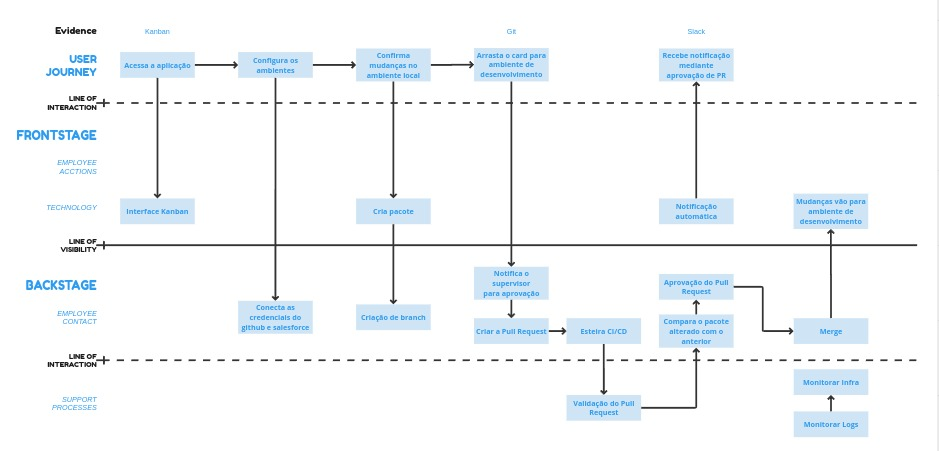
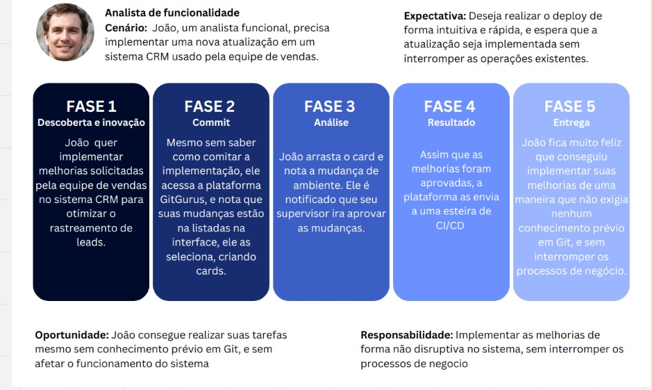
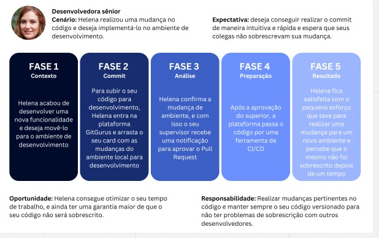
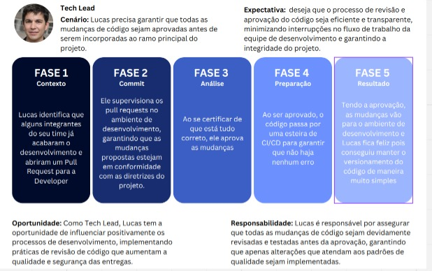

# Documentação Completa do Service Blueprint e Jornadas de Usuário

## 1. Contexto do Service Blueprint

O Service Blueprint apresentado abaixo exibe o processo de desenvolvimento e implementação de novas funcionalidades em um sistema CRM. Ele detalha as etapas visíveis e invisíveis aos usuários, desde a concepção da ideia até a entrega e monitoramento.

### Relações apresentadas no diagrama:

#### Frontstage:
- Acesso à plataforma Kanban para visualizar e solicitar novas funcionalidades.
- Interação com a interface para criar cards representando as solicitações.
- Recebimento de notificações sobre o status da solicitação.
- Acesso ao ambiente de desenvolvimento para testar as implementações.

#### Backstage:
- Criação de pacotes de código para as novas funcionalidades.
- Criação de branches no repositório para isolar o desenvolvimento.
- Conexão com o repositório Git para versionamento.
- Submissão de Pull Requests para revisão e aprovação do código.
- Execução do processo de CI/CD para integrar e entregar a funcionalidade.
- Merge do código aprovado ao código principal do sistema.

#### Processos de Suporte:
- Validação dos Pull Requests por outros desenvolvedores e pelo Tech Lead.
- Monitoramento da infraestrutura e dos logs do sistema para garantir estabilidade e identificar potenciais problemas.

## 2. Jornadas de Usuário detalhadas

As três jornadas de usuário representadas no Service Blueprint oferecem uma visão profunda das necessidades e expectativas de diferentes perfis de usuário:

### 2.1. Analista de Funcionalidade (João):

**Cenário:** João precisa implementar melhorias no CRM de forma ágil e intuitiva, sem impactar negativamente o fluxo de trabalho da equipe de vendas.

**Expectativa:** João almeja uma experiência fluida, com etapas claras e feedback constante sobre o andamento da solicitação. Ele busca autonomia para propor melhorias e visualizar seu impacto no sistema.

**Fases da jornada:**
- **Fase 1 (Descoberta e Inovação):** João identifica a necessidade de melhorias no CRM a partir da sua experiência e do feedback da equipe de vendas.
- **Fase 2 (Commit):** João acessa a plataforma Kanban, familiariza-se com a interface e cria cards detalhando as melhorias desejadas.
- **Fase 3 (Análise):** João recebe notificações automáticas sobre a análise da sua solicitação, com a possibilidade de interagir e fornecer mais informações.
- **Fase 4 (Resultado):** João acompanha o desenvolvimento da sua solicitação, recebe atualizações sobre o progresso e valida a implementação no ambiente de desenvolvimento.
- **Fase 5 (Entrega):** João celebra a entrega das melhorias, reconhecendo o impacto positivo no dia a dia da equipe de vendas.

### 2.2. Desenvolvedora Sênior (Helena):

**Cenário:** Helena é responsável por traduzir as solicitações de novas funcionalidades em código, utilizando as melhores práticas de desenvolvimento para garantir a qualidade e estabilidade do sistema.

**Expectativa:** Helena busca um processo de desenvolvimento eficiente, com ferramentas que facilitem a organização do trabalho, a colaboração entre a equipe e a garantia de que seu código não seja sobrescrito por outros desenvolvedores.

**Fases da jornada:**
- **Fase 1 (Contexto):** Helena recebe a especificação da nova funcionalidade a ser desenvolvida.
- **Fase 2 (Commit):** Helena cria uma branch no repositório para isolar o desenvolvimento da funcionalidade, garantindo que seu trabalho não entre em conflito com o código principal.
- **Fase 3 (Análise):** Helena testa exaustivamente a nova funcionalidade em um ambiente de desenvolvimento dedicado, garantindo que o código esteja funcionando como esperado.
- **Fase 4 (Preparação):** Helena submete um Pull Request para revisão do seu código. O Tech Lead e outros desenvolvedores analisam o código, sugerem alterações e aprovam a implementação.
- **Fase 5 (Resultado):** Após a aprovação do Pull Request, o código de Helena é integrado ao código principal do sistema, garantindo que a nova funcionalidade estará disponível para os usuários finais.

### 2.3 Tech Lead (Lucas):

**Cenário:** Lucas supervisiona a equipe de desenvolvimento, garantindo a qualidade do código, a fluidez do processo de desenvolvimento e a integridade do sistema CRM.

**Expectativa:** Lucas busca ter uma visão holística do projeto, acompanhando o progresso de cada solicitação, identificando potenciais gargalos no processo e garantindo que todas as alterações no código estejam de acordo com as diretrizes do projeto.

**Fases da Jornada:**
- **Fase 1 (Contexto):** Lucas acompanha as solicitações de novas funcionalidades, delega tarefas para a equipe de desenvolvimento e define prioridades.
- **Fase 2 (Commit):** Lucas supervisiona a criação de branches no repositório, certificando-se de que cada funcionalidade esteja sendo desenvolvida de forma organizada e isolada.
- **Fase 3 (Análise):** Lucas participa ativamente do processo de revisão de código, analisando os Pull Requests submetidos pela equipe, garantindo a qualidade e a conformidade com as diretrizes do projeto.
- **Fase 4 (Preparação):** Lucas autoriza a integração do código ao repositório principal após a aprovação do Pull Request, garantindo que a nova funcionalidade seja incorporada ao sistema de forma segura e eficiente.
- **Fase 5 (Resultado):** Lucas monitora o sistema após a implementação da nova funcionalidade, verificando se tudo está funcionando como esperado e se a equipe de vendas está satisfeita com a mudança.
